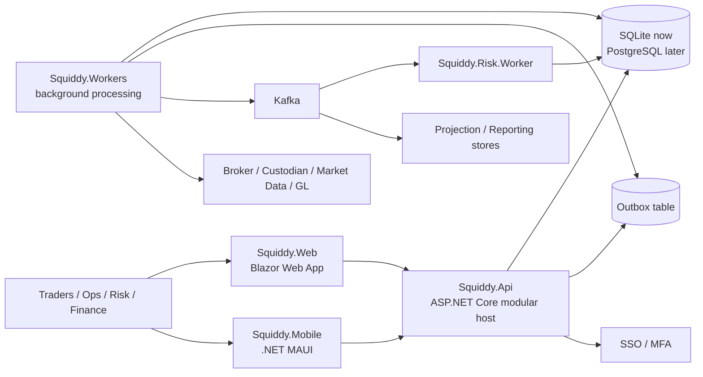

# Target Architecture

## Position

Squiddy should evolve into a modular .NET trading platform with one primary transactional backend, one worker runtime, and selectively extracted heavy-compute or high-churn services.

The immediate target is:

- `ASP.NET Core` as the primary application host and API surface
- `Blazor Web App` as the main enterprise UI
- `.NET MAUI` for approvals, alerts, and companion workflows
- `SQLite` as the current development system of record
- `ORM-ready persistence seams` so the backend can move to PostgreSQL later without rewriting application logic
- `Kafka` as the future event backbone, introduced behind outbox boundaries rather than through direct producer calls from business logic

## C4 Container View



## Runtime Shape

- `Squiddy.Api`
  - Single deployable transactional host for modules.
  - Owns commands, queries, object authorization checks, workflow orchestration, and audit capture.
  - Keeps business writes synchronous and deterministic.
- `Squiddy.Workers`
  - Runs outbox dispatch, inbox processing, timers, retries, notifications, workflow continuations, and projections.
  - Should be stateless and horizontally scalable.
- `Squiddy.Risk.Worker`
  - Separate worker for pre-trade/post-trade risk and portfolio recalculation when compute pressure justifies isolation.
  - Can stay in-process with `Squiddy.Workers` until performance says otherwise.
- `Squiddy.Web`
  - Blazor server-first UI for internal operators.
  - Use SSR and server interactivity by default; reserve client interactivity for hot blotter scenarios.
- `Squiddy.Mobile`
  - Narrow surface area: approvals, exceptions, breach notifications, and lightweight dashboards.

## Recommended Repo Layout

```text
src/
  Apps/
    Squiddy.Api/
    Squiddy.Workers/
    Squiddy.Risk.Worker/
    Squiddy.Web/
    Squiddy.Mobile/
  BuildingBlocks/
    Squiddy.Hosting/
    Squiddy.Persistence/
    Squiddy.Messaging/
    Squiddy.Security/
    Squiddy.Audit/
    Squiddy.Observability/
  Modules/
    IdentityAccess/
    ReferenceData/
    Workflow/
    Orders/
    Execution/
    Trades/
    Positions/
    Risk/
    Operations/
    Ledger/
    Reporting/
    Agents/
  Integrations/
    Brokers/
    Custodians/
    MarketData/
    Sso/
    Postgres/
    Kafka/
tests/
  Architecture/
  Integration/
  EndToEnd/
  Performance/
infra/
  terraform/
  docker/
  k8s/
docs/
  adr/
  architecture/
```

## Module Boundaries

### Keep in the primary host early

- `IdentityAccess`
  - Users, groups, roles, direct rights, object grants, MFA policy, AI-agent principals.
- `ReferenceData`
  - Instruments, books, counterparties, settlement instructions, calendars, legal entities.
- `Workflow`
  - Human approvals, exception handling, timed tasks, AI-agent supervised actions.
- `Orders`
  - Order intent, validation, routing requests, trader workflows.
- `Trades`
  - Canonical trade booking, amendments, cancels, allocations, lifecycle events.
- `Positions`
  - Intraday positions, inventory, lots, realized/unrealized PnL.
- `Operations`
  - Confirmation, matching, settlements, breaks, reconciliations.
- `Ledger`
  - Subledger, journal generation, close controls, GL export.

### Extract only when justified

- `Execution`
  - Extract when broker/venue integration or connectivity release cadence becomes independent.
- `Risk`
  - Extract when compute isolation or pre-trade latency pressure demands it.
- `Reporting`
  - Extract when read-model scale or regulatory distribution jobs diverge from core release cadence.

## Backend Design Rules

- Keep business logic above the persistence boundary.
- Use repository and storage-session abstractions now, even while SQLite remains the active store.
- Hide transaction implementation details behind a backend unit-of-work boundary.
- Make writes append-friendly and audit-first.
- Treat Kafka as downstream propagation, not as the source of truth.
- Never let one module write directly into another module's tables.

## ORM Transition Guidance

The persistence abstraction should support two backend implementations:

1. `SQLite backend`
   - Current default for local development and early delivery.
   - Uses SQL repositories behind `IWorkflowStorageBackend`.
2. `ORM-backed relational backend`
   - Future EF Core or similar provider using PostgreSQL.
   - Should implement the same backend and repository contracts.

Recommended migration path:

- Keep application services dependent on repository interfaces only.
- Introduce module-specific ORM contexts later, not one giant global context.
- Preserve module-owned schemas so SQLite table groups map cleanly to PostgreSQL schemas.
- Keep read models free to use Dapper/raw SQL even after write-side ORM adoption.

## Phased Roadmap

### Phase 1: Platform foundation

- Create `Squiddy.Api`, `Squiddy.Workers`, and `Squiddy.Web`.
- Standardize auth, object authorization, audit envelopes, correlation IDs, and module registration.
- Keep SQLite active, but route all persistence through backend abstractions.
- Introduce outbox tables even before Kafka is live.

Exit criteria:

- A secured module can create, update, audit, authorize, and recover objects consistently.

### Phase 2: Workflow and reference kernel

- Promote the existing workflow engine into the `Workflow` module.
- Add task inboxes, timed actions, approval policies, and actor identity propagation.
- Add `ReferenceData` module with versioned static data.

Exit criteria:

- Human and system actions can be governed by workflow with full audit lineage.

### Phase 3: Front-office MVP

- Add `Orders`, `Execution`, `Trades`, and basic `Positions`.
- Deliver trader blotter, trade capture, intraday position updates, and pre-trade limit checks.

Exit criteria:

- Order to fill to booked trade works end to end with audit and position impact.

### Phase 4: Middle-office MVP

- Add allocations, confirmations, operational exceptions, and break workflows.
- Add approval queues and step-up auth for sensitive actions.

Exit criteria:

- Exceptions are handled in-system, not by email and spreadsheets.

### Phase 5: Back-office and finance controls

- Add settlement workflows, cash projections, reconciliation, journals, and GL export.
- Introduce official EOD views separate from intraday operational views.

Exit criteria:

- Trades produce operational obligations and accounting consequences with traceable lineage.

### Phase 6: Scale-out

- Introduce Kafka-based outbox dispatch.
- Extract `Risk`, `Execution`, or `Reporting` only where operational evidence justifies it.
- Swap SQLite for PostgreSQL in production by implementing the relational backend contracts.

Exit criteria:

- Runtime boundaries follow measured scale and control needs rather than speculative architecture.

## Trade-offs

- `Modular monolith first` is simpler, faster, and safer than full microservices early on, but it requires discipline around module boundaries.
- `SQLite now` accelerates delivery, but concurrency and operational realism are limited, so production hardening still points toward PostgreSQL.
- `ORM-ready boundary` reduces migration pain later, but it adds a small amount of abstraction today; that is worth paying because it keeps workflow logic storage-agnostic.
- `Blazor as the main UI` maximizes stack coherence, but extremely latency-sensitive blotter screens may still need selective client-heavy patterns.
